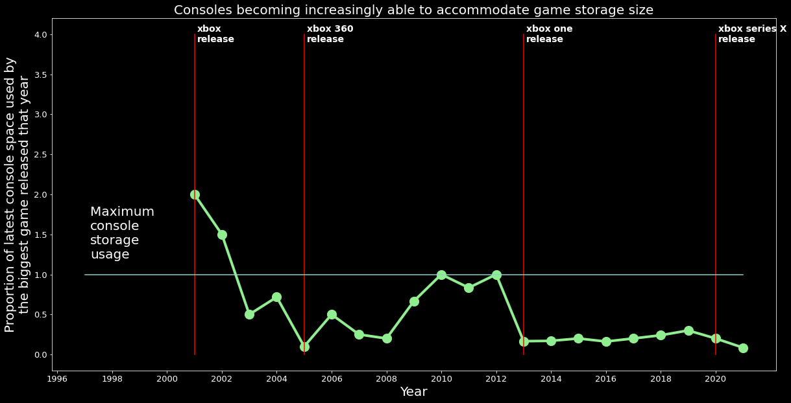

# Steam Games
An analysis on the hardware requirements of PC video games alongside the rate at which gaming consoles scale up their hardware. Also looking into steam game hardware requirement trends.

# Description
In this project, I compare the growing hardware demands of PC video games with the hardware specifications of gaming consoles, such as the xbox and the playstation console lines. I'm looking to identify a relationship between a PC game's hardware requirements and the release date of gaming consoles. I think this can be useful in analyzing the release trend of video game consoles and possibly predicting when the next console could release. 

Along with the hardware reqs vs console analysis, I also delve into analyzing the hardware requirements of all games on the steam store. Using data provided by [steamspy](https://steamspy.com), I can look at many additional attributes of a game, such as popularity, overall sentiment, tags, and even unique developers.

### My goals:
- Determine a relationship between game hardware requirements and gaming console release dates.
- Look at popular games on steam and determine what hardware trends can be recognized between them.

# Extracted info

Notebooks + code can be found [here](https://github.com/codencoding/steam-games/tree/main/notebooks/analysis)

## Console hardware analysis

## Steam game analysis

## Popular games analysis

